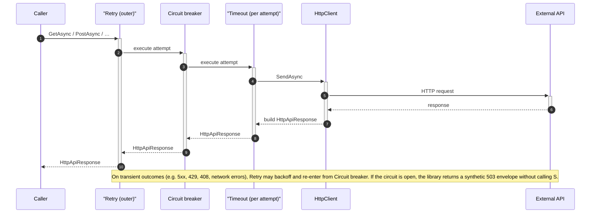

# Httpclient Resilience Wrap

A resilient HTTP client library for **.NET 10**, built on **Polly v8**, that provides retry, circuit breaker, timeout, and correlation ID propagation out of the box.

## Features

- **Retry** – exponential backoff with configurable attempts and base delay  
- **Circuit Breaker** – trips after a failure ratio threshold, preventing cascading failures  
- **Timeout** – per-attempt timeout independent of the outer cancellation token  
- **Correlation ID** – auto-generated or caller-supplied ID attached to every outbound request header  
- **Two-tier configuration** – service-wide defaults via `ExternalServiceConfig`, per-request overrides via `HttpRequestParameter`

**Visual overview (pipelines, sequences, response contract):** [docs/resilience-flow.html](docs/resilience-flow.html) — open in the browser locally, or view the same path on GitHub.

### Request flow (sequence)



## Demo API

A fully working Minimal API that exercises every feature is available in [`HttpclientResilienceWrap.Demo`](HttpclientResilienceWrap.Demo/README.md). Run `dotnet run` inside that folder and open Swagger to try retry, circuit breaker, timeout, correlation ID, typed/untyped responses, and config-less registration.

## Installation

Add a project reference to this library from your application:

```shell
dotnet add path/to/YourApp.csproj reference path/to/HttpclientResilienceWrap/HttpclientResilienceWrap.csproj
```

## Quick start: `appsettings.json` and `Program.cs`

### Minimal configuration

```json
{
  "MyApi": {
    "BaseUri": "https://api.example.com"
  }
}
```

### Full configuration

Any property you omit keeps the default from the [Configuration reference](#configuration-reference) tables.

```json
{
  "MyApi": {
    "ClientName": "MyApi",
    "BaseUri": "https://api.example.com",
    "ApiKey": "your-api-key",
    "Retry": 3,
    "RetryDelayMilliseconds": 1000,
    "TimeoutSeconds": 10,
    "EnableDebugLogging": true,
    "Handler": {
      "LifetimeMinutes": 5,
      "MaxConnectionsPerServer": 20,
      "AllowAutoRedirect": true,
      "MaxAutomaticRedirections": 3
    },
    "CircuitBreaker": {
      "Enabled": true,
      "MinimumThroughput": 10,
      "FailureRatio": 0.5,
      "SamplingDurationSeconds": 30,
      "BreakDurationSeconds": 30
    },
    "CorrelationId": {
      "Enabled": true,
      "HeaderName": "X-Correlation-Id",
      "GenerateIfAbsent": true
    }
  }
}
```

### Register from configuration

Bind each section to a type that inherits `ExternalServiceConfig` and call `InstallHttpClient` once per API:

```csharp
using HttpclientResilienceWrap.Extensions;
using HttpclientResilienceWrap.Options;

public sealed class MyApiConfig : ExternalServiceConfig { }

var myApiConfig = builder.Configuration
    .GetSection("MyApi")
    .Get<MyApiConfig>() ?? new MyApiConfig();

builder.Services.InstallHttpClient(myApiConfig);
// Equivalent: builder.Services.InstallHttpClient<MyApiConfig>(myApiConfig);
```

You need **`Microsoft.Extensions.Configuration.Binder`** (pulled in automatically with typical ASP.NET Core / hosting SDK projects).

**Note:** `ApiKey` and `ApiPass` bind into `ExternalServiceConfig` but are **not** attached to outbound requests automatically. Use `HttpRequestParameter.Token` or `Headers`, or your own middleware, to send credentials.

### Multiple external services

**appsettings.json**

```json
{
  "PaymentApi": {
    "BaseUri": "https://payments.example",
    "Retry": 3
  },
  "NotificationApi": {
    "BaseUri": "https://notify.example",
    "Retry": 2
  }
}
```

**Program.cs**

```csharp
var paymentConfig = builder.Configuration
    .GetSection("PaymentApi")
    .Get<PaymentApiConfig>() ?? new PaymentApiConfig();

var notificationConfig = builder.Configuration
    .GetSection("NotificationApi")
    .Get<NotificationApiConfig>() ?? new NotificationApiConfig();

builder.Services.InstallHttpClient<PaymentApiConfig>(paymentConfig);
builder.Services.InstallHttpClient<NotificationApiConfig>(notificationConfig);
```

---

## Dependency injection

### `InstallHttpClient` overloads

Extension methods on `IServiceCollection` (`HttpclientResilienceWrap.Extensions.HttpClientExtension`):

| Overload | Usage |
|---------|-------|
| `InstallHttpClient<TConfig>(config)` | Full config — binds from `appsettings.json` or inline object |
| `InstallHttpClient(clientName)` | Config-less — default resilience settings, URI supplied per request |

Both overloads:

1. Register a **named** `HttpClient` with `IHttpClientFactory` using `ClientName` as the factory key.
2. Register **`IHttpClientService`** as **keyed scoped** with the same key.

Call **once per external API**. Different `ClientName` values stay fully isolated: separate connection pool, handler, and resilience state.

### Config-less registration

When you don't need a config class or `appsettings.json` section — just pass a name and supply the URI per request:

```csharp
builder.Services.InstallHttpClient("MyService");
```

Resolve with the same string key and set the target via `HttpRequestParameter.Uri`:

```csharp
var response = await http.GetAsync<MyDto>(
    new HttpRequestParameter { Uri = new Uri("https://api.example.com/data") },
    ct);
```

This uses default resilience settings (no retries, 10s timeout, circuit breaker enabled). Useful for simple or ad-hoc calls where a full config class would be overkill.

### Registration without JSON

For tests or hard-coded setup:

```csharp
using HttpclientResilienceWrap.Extensions;
using HttpclientResilienceWrap.Options;

builder.Services.InstallHttpClient(new PaymentApiConfig
{
    BaseUri = "https://api.payments.example",
    Retry = 3,
});
```

For section binding from `appsettings`, see [Quick start](#quick-start-appsettingsjson-and-programcs).

### Resolving `IHttpClientService`

The keyed DI key is always **`config.ClientName`**. If you never assign `ClientName`, it defaults to the **concrete config type’s name** (e.g. `PaymentApiConfig` → `"PaymentApiConfig"`). If you set `ClientName` in code or configuration, use **that exact string** when resolving.

**Constructor injection** (typical in minimal APIs / controllers):

```csharp
using Microsoft.Extensions.DependencyInjection;

public sealed class CheckoutService(
    [FromKeyedServices(nameof(PaymentApiConfig))] IHttpClientService paymentHttp)
{
    // paymentHttp uses the named HttpClient + pipeline for PaymentApiConfig
}
```

**Manual resolution**:

```csharp
var paymentHttp = serviceProvider.GetRequiredKeyedService<IHttpClientService>(nameof(PaymentApiConfig));
```

To use the raw `HttpClient` registered by the same call, resolve it from `IHttpClientFactory`:

```csharp
var client = httpClientFactory.CreateClient(nameof(PaymentApiConfig)); // or config.ClientName
```

### `IHttpClientService` — sending requests

`IHttpClientService` exposes **`GetAsync`**, **`PostAsync`**, **`PutAsync`**, and **`DeleteAsync<T>`**, each taking a **`HttpRequestParameter`** (`HttpclientResilienceWrap.Extensions`) and an optional **`CancellationToken`**. They return **`HttpApiResponse<T>`** (same namespace).

```csharp
using HttpclientResilienceWrap.Extensions;

HttpApiResponse<WidgetDto> response = await paymentHttp.GetAsync<WidgetDto>(
    new HttpRequestParameter { Path = "widgets/42" },
    cancellationToken);
```

Set **`BaseUri`** once in configuration; use **`Path`** for relative endpoints (combined with `BaseUri`). For a different host than `BaseUri`, set **`Uri`** instead of **`Path`** (if both are set, **`Path` takes precedence**).

```csharp
new HttpRequestParameter
{
    Uri = new Uri("https://other-service.example/endpoint")
}
```

### Inject and call (keyed `IHttpClientService`)

Resolve the client with **`[FromKeyedServices(...)]`** using the same key as `ClientName` (by default, the config type name):

```csharp
using HttpclientResilienceWrap.Abstractions;
using HttpclientResilienceWrap.Extensions;
using Microsoft.Extensions.DependencyInjection;

public sealed class MyService(
    [FromKeyedServices(nameof(MyApiConfig))] IHttpClientService httpClient)
{
    public async Task<MyResponse?> GetDataAsync(CancellationToken ct)
    {
        var result = await httpClient.GetAsync<MyResponse>(
            new HttpRequestParameter
            {
                Path = "/data",
                Token = "bearer-token"
            },
            ct);

        return result.IsSuccessStatusCode ? result.Content : null;
    }
}
```

### What each registration gives you

- A dedicated **named** `HttpClient` (`ClientName`, default = config type name)
- Its own **base address** and **connection pool** (via the factory + primary handler)
- **Isolated resilience** per registration — e.g. a payment outage does not trip the circuit for notifications

---

## Configuration Reference

### ExternalServiceConfig

| Property | Type | Default | Description |
|---------|------|--------|------------|
| ClientName | string | (type name) | Named HttpClient key. Defaults to the concrete class name (e.g. "MyApiConfig"). Can be overridden via appsettings.json or in the constructor. |
| BaseUri | string | | Base address used with HttpClientFactory |
| ApiKey | string? | null | Optional API key for the service |
| ApiPass | string? | null | Optional API password for the service |
| Retry | int | 0 | Number of retries after the first attempt. Set to 0 to disable retries; use a positive value (e.g. 3) to enable exponential back-off |
| RetryDelayMilliseconds | int | 500 | Base delay (ms) for exponential back-off. Example with Retry = 3: 500ms → 1000ms → 2000ms (~3.5s total wait between attempts) |
| TimeoutSeconds | int | 10 | Per-attempt timeout in seconds |
| EnableDebugLogging | bool | false | Enable debug logging (curl + sanitized response) for all requests to this service. Can be overridden per request |
| Handler | HttpHandlerOption | (see below) | Connection pool and redirect settings |
| CircuitBreaker | CircuitBreakerOption | (see below) | Circuit breaker settings |
| CorrelationId | CorrelationIdOption | (see below) | Correlation ID header settings |

### Handler — HttpHandlerOption

| Property | Type | Default | Description |
|---------|------|--------|------------|
| LifetimeMinutes | int | 5 | Handler recycle interval – allows DNS changes to propagate |
| MaxConnectionsPerServer | int | 20 | Max concurrent connections to the same server |
| AllowAutoRedirect | bool | true | Follow HTTP redirect responses automatically |
| MaxAutomaticRedirections | int | 3 | Max redirects to follow (requires AllowAutoRedirect = true) |

### CircuitBreaker — CircuitBreakerOption

| Property | Type | Default | Description |
|---------|------|--------|------------|
| Enabled | bool | true | Enable or disable the circuit breaker |
| MinimumThroughput | int | 10 | Minimum requests in the sampling window before evaluation |
| FailureRatio | double | 0.5 | Failure ratio (0.0–1.0) that trips the circuit |
| SamplingDurationSeconds | int | 30 | Sampling window duration in seconds |
| BreakDurationSeconds | int | 30 | How long the circuit stays open before allowing a trial request |

### CorrelationId — CorrelationIdOption

| Property | Type | Default | Description |
|---------|------|--------|------------|
| Enabled | bool | true | Enable or disable correlation ID propagation |
| HeaderName | string | X-Correlation-Id | HTTP header name used to carry the correlation ID |
| GenerateIfAbsent | bool | true | Auto-generate a GUID when no correlation ID is supplied per request |

---

### HttpRequestParameter — per-request overrides

| Property | Type | Description |
|---------|------|------------|
| Path | string? | Relative path appended to `BaseUri` (e.g. `/users/123`). **Primary way to choose the endpoint.** |
| Uri | Uri? | Absolute URI — use when the host differs from `BaseUri`. If both `Path` and `Uri` are set, **`Path` wins.** |
| Token | string? | Bearer token, sent as `Authorization: Bearer <token>` |
| Headers | Dictionary<string,string>? | Additional request headers |
| Body | object? | Request body, serialized as JSON |
| MediaType | string? | Content-Type (default `application/json`) |
| Retry | int? | Retry count for this request only |
| Timeout | int? | Timeout in seconds for this request only |
| CorrelationId | string? | Correlation ID from an upstream caller |
| ClearHeaders | bool | Clears default `HttpClient` headers before sending |
| EnableDebugLogging | bool | Logs an equivalent **curl** command + sanitized response at **Debug** level. Also configurable at service level via `ExternalServiceConfig` |

---

## `HttpApiResponse<T>`

| Property | Type | Description |
|---------|------|------------|
| IsSuccessStatusCode | bool | `true` when the HTTP response was successful (2xx). |
| StatusCode | HttpStatusCode | HTTP status from the server, or a **synthetic** code for infrastructure failures (see below). |
| ReasonPhrase | string? | Reason phrase from the server, or a short library label for synthetic errors. |
| Content | T? | Deserialized body; may be `null` for errors or empty payloads. |
| ErrorMessage | string? | Set for **configuration / network / circuit breaker / timeout** outcomes; usually `null` for normal HTTP responses (including 4xx/5xx) where the server still returned a body. |

## Synthetic status codes (no exception from the pipeline)

For these cases the library returns an `HttpApiResponse<T>` instead of throwing; **`ErrorMessage`** carries the underlying message (exception or description).

| Situation | StatusCode | ReasonPhrase |
|-----------|------------|--------------|
| `Path` set but `BaseUri` missing, or no URI could be resolved | `400` BadRequest | `Invalid Request Configuration` |
| Circuit breaker open | `503` ServiceUnavailable | `Circuit Breaker Open` |
| Network failure after retries | `503` ServiceUnavailable (or status from `HttpRequestException` when present) | `Network Error` |
| Timeout after retries | `408` RequestTimeout | `Request Timeout` |

Deserializing **`Content`** with `System.Text.Json` can still throw (e.g. invalid JSON) after a successful HTTP response.

## Handling responses

```csharp
var result = await httpClient.GetAsync<MyDto>(new HttpRequestParameter { Path = "items" }, ct);

if (!result.IsSuccessStatusCode)
{
    // HTTP 4xx/5xx from the API, or a synthetic code from the table above
    var status = result.StatusCode;
    var reason = result.ReasonPhrase;
}

if (result.ErrorMessage is not null)
{
    // Configuration, circuit breaker, network, or timeout — see synthetic table
    var detail = result.ErrorMessage;
}

var data = result.Content; // when successful and body deserialized
```

---

## License

MIT
